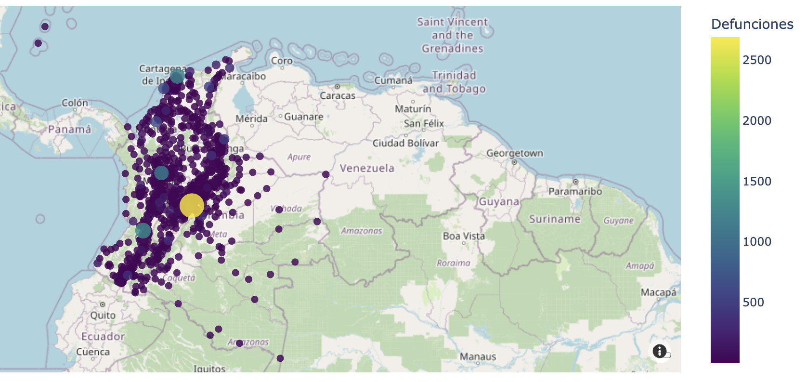
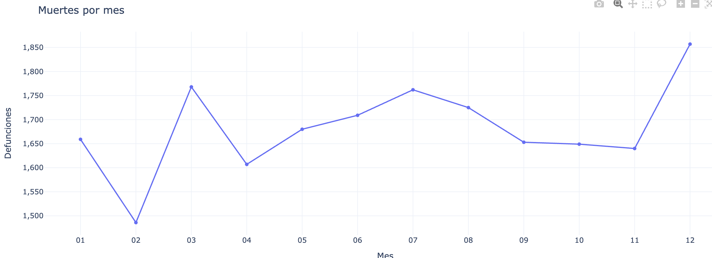
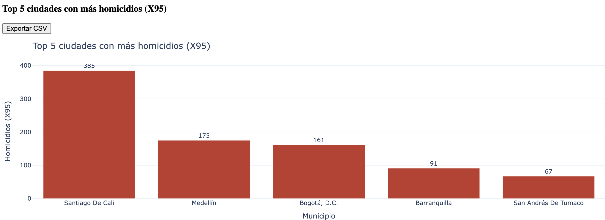
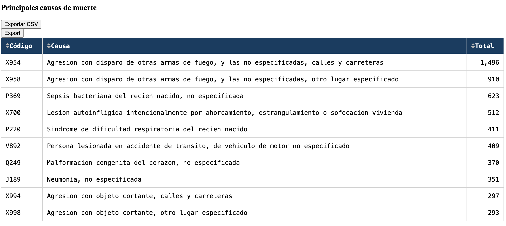
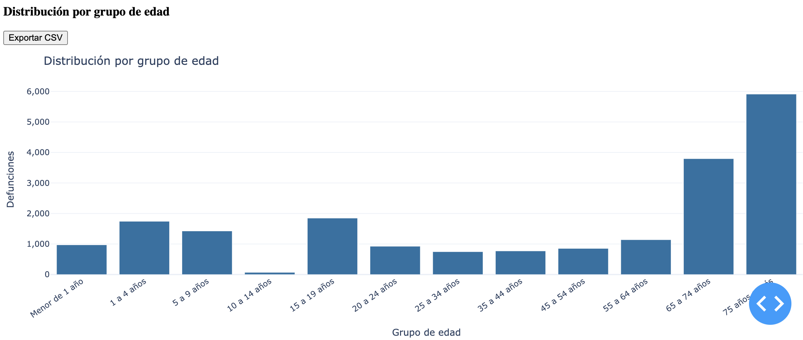
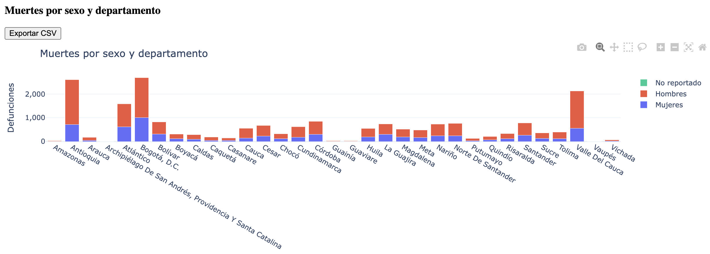

# Mortalidad Colombia 2019

## Introducción del proyecto
Aplicación web desarrollada con Dash para explorar de forma interactiva las estadísticas de mortalidad en Colombia durante 2019. El dashboard prioriza la accesibilidad mediante el uso de roles ARIA (`banner`, `main`, `region`) que describen la jerarquía para lectores de pantalla, indicadores `aria-live` que comunican cambios de estado y controles con `:focus-visible` personalizados para navegación vía teclado. Se incluyen mensajes de carga y placeholders que garantizan contexto mientras se actualizan las visualizaciones, además de atajos descriptivos en encabezados y etiquetas. El rendimiento se refuerza con cacheo en memoria y exportaciones diferidas a CSV.

## Objetivo
Analizar patrones de mortalidad por territorio, causa y grupo poblacional a partir de las bases públicas del DANE, facilitando la identificación de focos de violencia, estacionalidad y diferencias por sexo o edad.

## Estructura del proyecto
```
├── assets/
│   ├── screenshots/              # Capturas utilizadas en este README
│   └── style.css                 # Estilos personalizados del dashboard
├── data/
│   ├── processed/                # Caché parquet generado por la ingesta
│   └── raw/                      # Coloque aquí los archivos Excel originales
├── scripts/                      # Utilidades para tareas de soporte
├── src/mortalidad/               # Código fuente de la aplicación y CLI
├── tests/                        # Suite de pruebas con pytest y fixtures sintéticos
├── Makefile                      # Automatización de tareas locales
├── docker-compose.yml            # Orquestación de servicios para desarrollo
├── render.yaml                   # Blueprint de despliegue en Render
└── pyproject.toml                # Configuración de dependencias y linters
```

## Requisitos
- Python 3.11 o superior (probado con 3.13)
- Make (GNU)
- Virtualenv o similar (se crea automáticamente con `make dev-install`)
- Docker (opcional, para ejecución contenedorizada)
- Acceso a los archivos del DANE:
  - `NoFetal2019.xlsx`
  - `CodigosDeMuerte.xlsx`
  - `Divipola.xlsx`

## Despliegue en Render
1. Se deben ejecutar `make ingest` y `make validate` en local para generar `data/processed/mortalidad_2019.parquet` y verificar la integridad.
2. Se debe publicar el repositorio en GitHub/GitLab. Render detectará el blueprint definido en `render.yaml`.
3. En Render se selecciona **New → Blueprint**, se elige el repositorio y se confirma el servicio web sugerido.
4. Se configuran las variables de entorno: `ENV=production`, `MAPBOX_TOKEN=pk.xxx`, `DATA_DIR=data/raw`, `CACHE_TIMEOUT=300`.
5. Se mantiene `autoDeploy: true` para reconstruir ante cada push a `main`. El build ya ejecuta `python -m mortalidad.cli ingest --force` para regenerar el parquet antes de servir el dashboard.
6. Es recomendable revisar la URL asignada y validar los filtros principales; los logs de Render permiten diagnosticar cualquier fallo.

## Software
- Python, Dash y Plotly para la capa interactiva.
- Pandas y Pandera para ingesta, transformación y validación de datos.
- Flask-Caching para cacheo en memoria.
- Ruff, Black e isort para formato y linting.
- MyPy para tipado estático.
- Pytest y Coverage para pruebas automatizadas.
- Docker y docker-compose para paridad de entornos.

## Instalación
1. **Clonar el repositorio**
   ```bash
   git clone https://github.com/<usuario>/mortalidad-colombia-2019.git
   cd mortalidad-colombia-2019
   ```
2. **Configurar variables**
   ```bash
   cp .env.example .env
   # Ajustar DATA_DIR, PORT, MAPBOX_TOKEN si aplica
   ```
3. **Añadir datos de entrada**
   Se deben copiar los tres archivos Excel del DANE dentro de `data/raw/`. El repositorio ignora esta carpeta, por lo que no se versionan los datos sensibles.


4. **Crear entorno y dependencias**
   ```bash
   make dev-install
   ```
5. **Ejecutar la aplicación**
   ```bash
   make run
   # o
   python -m mortalidad.app
   ```
   La aplicación quedará disponible en `http://localhost:8050`.


6. **Comandos útiles**
   - `make format`: ordena imports y aplica Black.
   - `make lint`: ejecuta Ruff con todas las reglas activas.
   - `make typecheck`: lanza mypy en modo estricto.
   - `make test`: corre Pytest usando la misma configuración que CI.
   - `make ingest` / `make validate`: procesa los Excel y valida con Pandera.
   - `make run`: arranca el dashboard con las dependencias ya presentes.
   - `make pre-commit`: instala o actualiza los hooks locales.
   - `python -m mortalidad.cli ingest [--force]`: invocación directa de la ingesta.
   - `python -m mortalidad.cli validate`: validación manual del esquema.
   - `python -m mortalidad.cli serve --host 0.0.0.0 --port 8050`: servidor Dash vía CLI.


7. **Hooks de pre-commit**
   Se ejecuta `make pre-commit` para instalar los hooks que ejecutan Ruff, Black, isort y detect-secrets antes de cada commit.


8. **Configuración opcional en PyCharm**
   El repositorio puede importarse y asociarse al intérprete `.venv`. Mediante **Run → Edit Configurations… → Import from .run** se cargan las ejecuciones predefinidas (`Dash Server`, `PyTests`, `CLI Ingest`).

## Automatización con Make
El Makefile consolida las tareas frecuentes y comprueba que el entorno virtual exista antes de ejecutar cada herramienta. Esto facilita que todo el equipo use los mismos pasos y evita recordar comandos largos.

Principales objetivos:
- `make dev-install`: crea/actualiza el entorno `.venv` e instala dependencias.
- `make format`: ejecuta `isort` y `black` sobre `src/` y `tests/`.
- `make lint`: corre `ruff check` sin reinstalar paquetes.
- `make typecheck`: invoca `mypy` con la configuración estricta definida en `pyproject.toml`.
- `make test`: ejecuta Pytest con la configuración de cobertura del proyecto.
- `make pre-commit`: instala los hooks (`ruff`, `black`, `isort`, `detect-secrets`).
- `make doctor`: imprime la información del intérprete activo.

## Calidad de código y estilo
- `make format` → aplica `isort` + `black` para un estilo uniforme y sin imports duplicados.
- `make lint` → ejecuta `ruff`, detecta code smells y aplica reglas PEP 8.
- `make typecheck` → usa `mypy` para reforzar el tipado estático y detectar inconsistencias.
- `make test` → dispara Pytest asegurando que la suite continúe verde.
- `make pre-commit` → registra los hooks que ejecutan `ruff`, `black`, `isort` y `detect-secrets` antes de cada commit.
- El hook de `detect-secrets` evita filtrar credenciales; todos los comandos anteriores se reusan desde el Makefile y en CI.

## Pruebas y cobertura
El proyecto utiliza Pytest con fixtures sintéticos para validar componentes, callbacks y la ingesta. Al ejecutar las pruebas se genera un reporte de cobertura que ayuda a identificar áreas no ejercitadas del código.

### Ejecutar la suite
```bash
PYTHONPATH=src .venv/bin/pytest
```

### Analizar cobertura
```bash
PYTHONPATH=src .venv/bin/pytest --cov=src --cov-report=term-missing
```

Resultados principales del último análisis (vía `--cov-report=term-missing`):
- Cobertura global aproximada: 72 %.
- Módulos con cobertura alta (>90 %): `components` (hist, lines, pie), `layout`, `config`.
- Módulos con menor cobertura: `callbacks` y `data_loader` (por caminos no ejercitados en la ingesta real).

Para visualizar un reporte HTML detallado:
```bash
.venv/bin/coverage html && open htmlcov/index.html
```

Sugerencias para incrementar la cobertura:
- Incorporar pruebas de regresión sobre los callbacks (utilizando `dash[testing]`).
- Simular escenarios adicionales en `data_loader` (por ejemplo variaciones de columnas en los Excel).
- Añadir tests end-to-end cuando se disponga de `chromedriver` o Playwright.

## Visualizaciones con explicaciones de los resultados

### Mapa coroplético por departamento

Resalta los departamentos con mayor concentración. El uso de medias geográficas permite ubicar el centroide aproximado de cada territorio y los datos se actualizan según los filtros seleccionados. La capa se renderiza sobre Mapbox, lo que habilita teselas vectoriales con suavizado en los acercamientos, estilos personalizables y capacidad para combinar el coroplético departamental con marcadores municipales manteniendo un mapa de alto contraste y buena respuesta en navegadores modernos.

### Serie temporal mensual

La gráfica de líneas muestra la evolución mensual de los fallecimientos.

### Ranking de municipios con mayor incidencia

El gráfico de barras compara los municipios con más casos etiquetados como `X95`. Permite identificar rápidamente los focos urbanos principales; el botón de exportación genera un CSV para análisis posterior.

### Principales causas de muerte

La tabla resume las causas más frecuentes reportadas en el periodo. Además de los códigos CIE-10 se muestra la descripción y el número de casos, lo que facilita detectar si los homicidios predominan frente a otras categorías.

### Distribución por grupo de edad

El histograma agrupa la mortalidad por rangos etarios del DANE.

### Muertes por sexo y departamento

El diagrama de barras apiladas compara la mortalidad entre hombres y mujeres por departamento. Las categorías están ordenadas para resaltar las brechas de género, permitiendo focalizar políticas diferenciales.


## Resumen de hallazgos

El análisis de mortalidad en Colombia durante 2019 revela patrones importantes tanto en salud pública como en violencia social.
Las principales causas de muerte corresponden a agresiones con armas de fuego y enfermedades respiratorias, reflejando problemas de seguridad y atención médica.
En la distribución por sexo y departamento, los hombres presentan tasas de mortalidad significativamente mayores, concentradas en departamentos como Antioquia, Atlántico, Bogotá D.C. y Valle del Cauca.
El análisis de homicidios (X95) muestra que Santiago de Cali, Medellín y Bogotá D.C. lideran los casos, confirmando la persistencia de violencia urbana.
Por grupo de edad, los extremos de la vida concentran la mayor mortalidad: recién nacidos por causas infecciosas y adultos mayores por enfermedades crónicas.
En la evolución mensual, se evidencian aumentos en marzo, julio y diciembre, posiblemente vinculados a variaciones estacionales o factores sociales.
Finalmente, la distribución geográfica muestra una fuerte concentración en la región Andina, mientras que las zonas amazónicas y de la Orinoquía registran niveles menores, acordes con su densidad poblacional.
